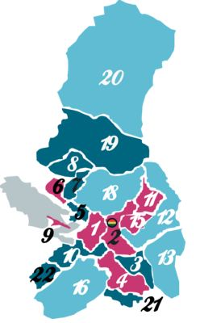

# La Paz 

## 1. Introducción 

La Paz, es la sede de gobierno del Estado Plurinacional de Bolivia. Su capital es La Paz. Está ubicado en el este del país, limitando al norte con el departamento de Pando, al este con el departamento de Beni, al sur con Oruto y al oeste con los paises de Chile y Perú. Desde el 7 de diciembre de 2014, La Paz es considerada como una de las nuevas siete ciudades maravillas del mundo.

Fuente: [Wikipedia La Paz](https://es.wikipedia.org/wiki/La_Paz)

## 2. Historia
La ciudad de La Paz fue fundada el 20 de octubre de 1548 por el capitán Alonso de Mendoza en la localidad de Laja como parte del Corregimiento de La Paz y para servir como punto de descanso para los viajeros que transitaban entre Potosí y Cuzco.

Tres días después fue trasladada más al este, a un lugar de clima templado ubicado al borde del altiplano,​ donde se inician las quebradas y el valle, llamado Chuquiago Marka (en aimara, chuqiyapu significa ‘chacra de oro’; probablemente llamado así por la explotación de pepitas de oro en los pequeños ríos del lugar). La Paz era controlada con firmeza por España, el rey español tenía la última palabra en todos los asuntos políticos. En 1781 hubo una revolución indígena, liderada por Tupak Katari, que sitió la ciudad impidiendo el paso de personas y mercancías, además de atacarla lanzando piedras de los cerros e incendiando tejados.

Como unidad administrativa, durante la colonia fue parte integrante del Corregimiento de La Paz y la Intendencia de La Paz.

Encabezado por Pedro Domingo Murillo y otros líderes locales, la lucha por la independencia de la dominación española trajo levantamientos contra las fuerzas realistas. La ciudad se levantó en armas el 16 de julio de 1809 contra el Imperio español e instauró el primer Gobierno libre de Hispanoamérica,[cita requerida] formando una Junta Tuitiva el 22 de julio de 1809. En la proclama de esta Junta Tuitiva que se puede leer: «Compatriotas: hasta aquí hemos tolerado una especie de destierro en el seno mismo de nuestra patria;[...] hemos guardando un silencio bastante parecido a la estupidez». Esto marcó el inicio formal de la liberación de América del Sur contra el Imperio español.

Poco después la Junta fue disuelta por los realistas, y el 29 de enero de 1810 Pedro Domingo Murillo y sus colaboradores fueron ahorcados en la Plaza de los Españoles. Antes de morir pronunciaría su más famosa frase: «Compatriotas, yo muero, pero la tea que dejó encendida nadie la podrá apagar, ¡viva la libertad!». Su nombre sería recordado en el nombre de la plaza.

El departamento de La Paz en el que se encuentra el municipio fue creado por Decreto Supremo del 23 de enero de 1826 junto a los departamentos de Chuquisaca, Potosí, Santa Cruz y Cochabamba durante el Gobierno de Antonio José de Sucre.[cita requerida]

El 3 de enero de 1827 el congreso constituyente de Bolivia amplió el nombre de la ciudad a La Paz de Ayacucho en honor a la victoria en la Batalla de Ayacucho.

Tras la guerra federal de 1898-1899, La Paz asumió la sede de Gobierno (poderes ejecutivo y legislativo), convirtiéndose así en sede política de facto en la administración nacional. La contienda enfrentó a liberales del norte, contra conservadores del sur que querían que la sede de Gobierno se quedase en Sucre. Esta situación quedó establecida el 25 de octubre de 1899, fecha en la que el general José Manuel Pando asumió la presidencia de la República a raíz del triunfo de la Revolución Federal.[cita requerida]

El 22 de julio de 2007 se llevó a cabo el El Gran Cabildo, donde aproximadamente dos millones de habitantes de la ciudad de La Paz y El Alto refrendaron la permanencia de la sede de Gobierno en esta ciudad.

Fuente: [Wikipedia La Paz Historia](https://es.wikipedia.org/wiki/La_Paz#Historia)

## 3. Atractivos

### En la ciudad de La Paz

* Casco Viejo de la Ciudad
* Plaza Murillo
* Palacio de Gobierno (Bolivia)
* El Paseo del Prado (El Prado).
* Templo y convento de San Francisco
* Catedral Metropolitana
* Parque Urbano Central (que tiene los parques Roosevelt y Laikakota, variedad de canchas polifuncionales, un museo interactivo, un campo ferial entre otros atractivos).
* Mercado de las Brujas
* Teatro Municipal de La Paz
* Teatro al Aire Libre
* Iglesia Santo Domingo
* La Calle Jaén (alberga 10 Museos, casas Coloniales, Bares y Restaurantes).
* Parque Metropolitano Laikacota
* Zoológico de Mallasa "Vesty Pakos Chuquiago Marka"
* Valle de la Luna
* Valle de las Ánimas
* Mirador Jach'a Kollo
* Estadio Hernando Siles (el más grande de Bolivia, local para los partidos de la Selección Boliviana de fútbol).
* Laguna Cota Cota
* Cañón de Palca
* Cine Teatro Monje Campero (uno de los cines más antiguos de ciudad de La Paz, cuenta con la pantalla más grande de Bolivia).
* Mi Teleférico
* Sopocachi (Zona artística de la ciudad).
* Zona Sur
* Los Puentes Trillizos
* La Muela del Diablo
* Jardín Japonés

### En los alrededores de la ciudad de La Paz

* Cerro Illimani (la mayor cumbre de la Cordillera Real).
* Montaña Huayna Potosí
* Chacaltaya (pista de nieve más alta del mundo).
* Lago Titicaca
* Copacabana (Bolivia) (pueblo a orillas del lago Titicaca).
* Parque Nacional Madidi
* Sorata
* Coroico (pueblo de Los Yungas, región con clima cálido y húmedo y mucha vegetación).
* Tiwanaku (ruinas de la cultura Tiwanacota).
* Montaña Condori
* Palca (pueblo en las faldas del nevado Illimani).
* Parque Nacional Cotapata
* Caminos Precolombinos: Takesi, el Choro, Yunga Cruz y el Camino del Oro
* Termas de Urmiri
* Reserva de la biosfera y tierra comunitaria de origen Pilón Lajas
* El Valle de Zongo
* Lago Titicaca (Varias poblaciones a orillas del lago e islas)

